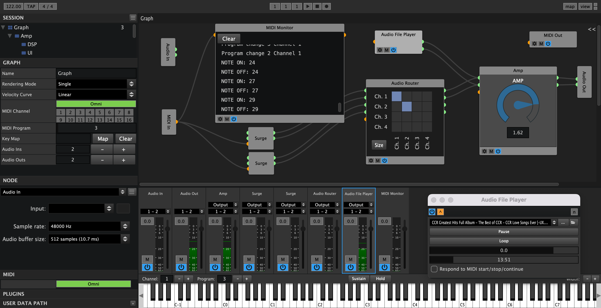

  

# Element

### ADVANCED AUDIO PLUGIN HOST
This is the community version of Element, a modular AU/LV2/VST/VST3/CLAP audio plugin host. Create powerful effects, racks and instruments by connecting nodes to one another. Integrates with your existing hardware via standard protocols such as MIDI. See [kushview.net](https://kushview.net/element/) for more information and [pre-built binaries](https://kushview.net/element/download/). 

_See also:_ [Element User Manual](https://element.readthedocs.io)

### Compatibility
Element currently loads most major plugin formats.

| OS       | Version              | Formats                    |
| -------- |:--------------------:| --------------------------:|
| Linux*   |       -              | LADSPA/LV2/VST3/CLAP       |
| Mac OSX  | 14.0 (Sonoma) and up | AU/VST/VST3/LV2/CLAP       |
| Windows  | XP and up            | VST/VST3/LV2/CLAP          |

_*Ubuntu is the most tested, but should run on any major distribution_

### Features
* Runs standalone or as a plugin in your DAW**
* Route Audio and MIDI from anywhere to anywhere
* Play virtual instruments and effects live
* Create re-usable instruments and effect graphs
* External Sync with MIDI Clock
* Sub Graphing – Nest Graphs within each other
* Custom Keyboard Shortcuts
* Placeholder Nodes
* Built In Virtual Keyboard
* Multiple Undo/Redo
* Scripting — Custom DSP and DSP UIs with sandboxed Lua scripting
* Embed plugin UIs directly in Graphs
* Plugin browser — favorites, recently used, type badges, and format labels
* Session browser — recent files tracking with category organization
* Quick Scan — discover plugins without loading or validating for faster startup
* Icon sidebar navigation — compact panel switcher for Sessions, Plugins, Inspector, and Editor
* Single-instance enforcement — prevents multiple copies from running simultaneously

**Graph Editor**
* Minimap navigation — bird's eye view of large graphs (Shift+M to toggle)
* Node search — quickly find and insert nodes by name (Cmd+F)
* Comment boxes — visually group related nodes with color labels (Shift+C)
* Molecule templates — save and reload reusable node group patterns
* Wire activity animation — audio glow and animated MIDI dots on active connections
* Plugin insertion into existing wires — drag a plugin onto a connection to insert it inline
* Alignment tools — snap-to-grid and auto-align selected nodes
* Lasso selection — drag to select multiple nodes, Shift+click to extend

**Plugin Sandbox Isolation**
* Out-of-process hosting protects the main application from plugin crashes
* Lock-free shared memory audio IPC with semaphore signaling for cross-process coordination
* Atomic pointer-swap operations in real-time paths eliminate lock contention
* Automatic crash recovery with state restoration
* Xrun detection and graceful degradation
* Real-time thread priority for sandbox worker audio processing

**Reroute Nodes**
* Generic, Audio, and MIDI reroute nodes for cleaner graph layouts without long crossing wires

* And more...

### Building 
See [building.md](./docs/building.md) for instructions and dependency details.

### Contributing
If you'd like to contribute code please review the [code style](./docs/cppstyle.md) and [contributor notes](CONTRIBUTING.md) before submitting pull requests.  You may also want to join the [#element](https://discord.gg/fAsQ5fMuHy) channel on the Kushview [Discord](https://discord.gg/fAsQ5fMuHy) server.

### Testing
Element includes AX-based UI automation and verification tools for macOS. See [tools/automation/README.md](./tools/automation/README.md) for running deterministic UI verification tests without screenshots.

### Issue Reporting
Please report bugs and feature requests on Gitlab. [Element issue tracker](https://gitlab.com/kushview/element/-/issues).
